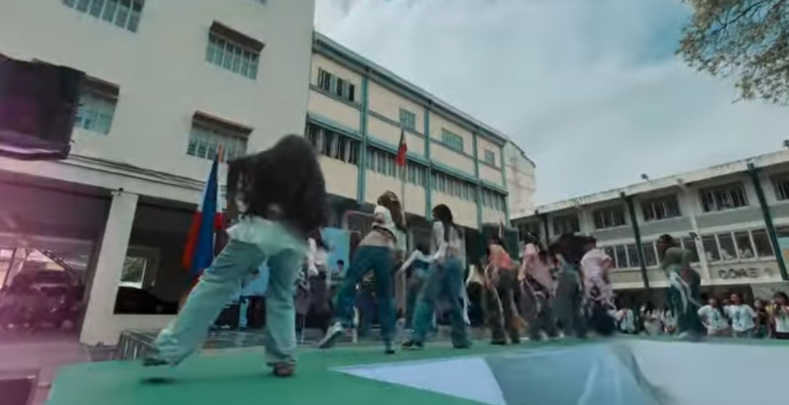
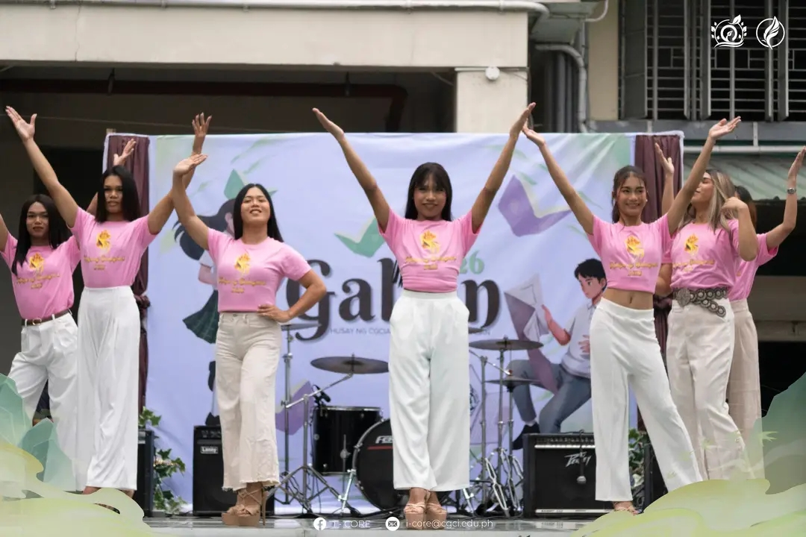
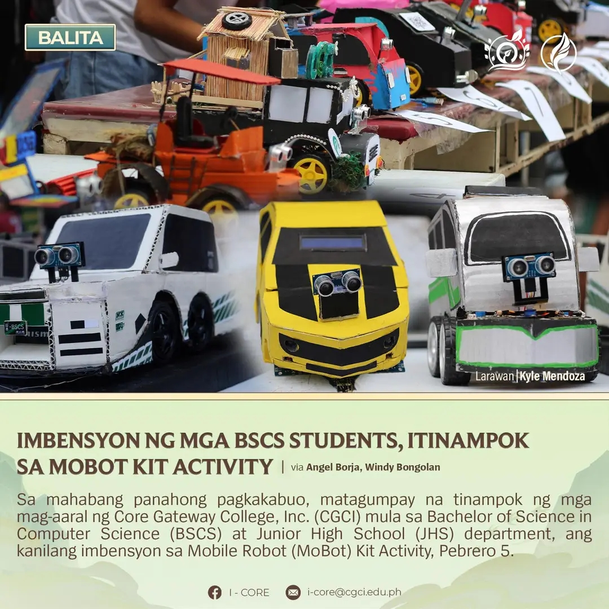

<!DOCTYPE html>
<html lang="en">
<head>
<meta charset="UTF-8">
<title>GALIAN 2026</title>

</head>

<body>

<nav>
    GALIAN 2026
</nav>

    

        

            
            

                This performance captures the energy and passion of students as they move 
                in perfect synchronization on stage. Their confident gestures and expressive 
                movements reflect months of dedication and teamwork. The applause and excitement 
                from the audience made this one of the most unforgettable highlights of GALIAN 2026.
            

        

        

            
            

                This stage presentation showcases unity, discipline, and artistic creativity. 
                The vibrant lighting and enthusiastic crowd created a powerful atmosphere 
                that truly represented collaboration and celebration during GALIAN 2026.
            

        

        

            
            

                The Mobile Robot (MoBot) invention highlights the brilliance and innovation 
                of students in technology. This project demonstrates programming skills, 
                logical thinking, and technical expertise — proving that GALIAN 2026 celebrates 
                both creativity and academic excellence.
            

        

    

    

        GALIAN 2026 is a remarkable celebration of talent, innovation, and youthful ambition. 
        It brings together artistic expression and technological brilliance in one inspiring event. 
        From breathtaking performances to impressive inventions, students demonstrate excellence, 
        teamwork, and determination. The event reflects strong community spirit and commitment 
        to growth and creativity.
    

<footer>
    Credits: Core Gateway College Inc. © 2026
</footer>

</body>
</html>
